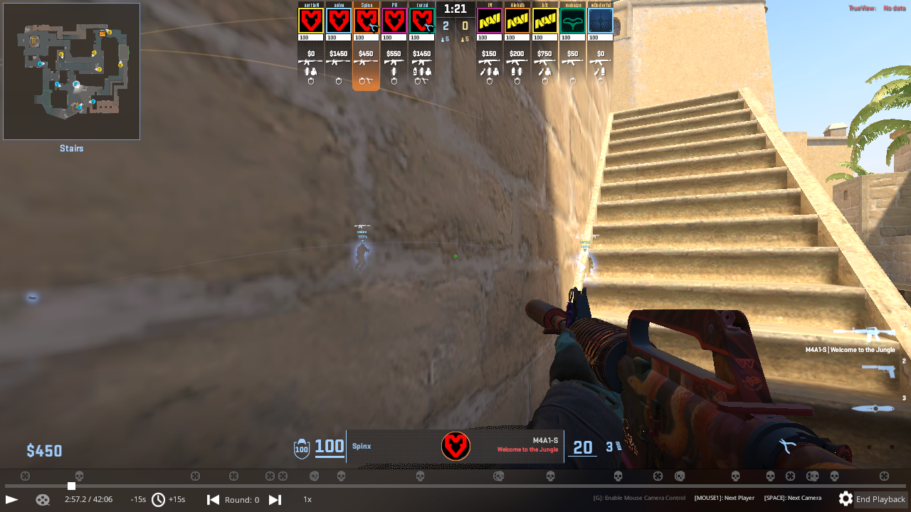
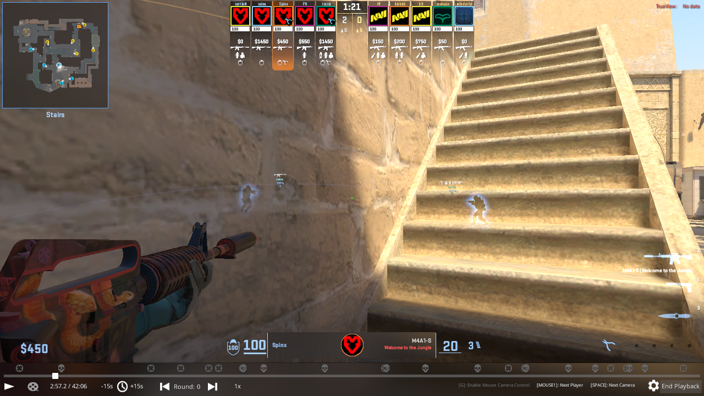

# 15 — Can the client be made to place the HUD per eye?

**Question.** [Issue #3](https://github.com/vr-meta/cs2-vr-spectator/issues/3) ends with
one: "is the tag placement driven from that cached matrix, or from something else in the
client? Answering that decides whether this is cheap or deep."

**Answer: deep.** The obvious cheap fix was tried and it fails, in a way that says
something useful about why.

## Reproducing it at a desk

Name tags drifting off players was only ever seen in the headset. It does not need one.

`mirv_vr_xr passes 2` renders the eye passes with no session, and the monitor ends up
showing the last of them — so with an exaggerated eye offset, whatever is wrong is wrong on
screen where it can be photographed.

```powershell
scripts\launch-cs2-experiment.ps1 -SelfBuilt -Demo pro_mirage.dem -ExecCfg exp15_hudfix
# F8 pause, F2 force two passes, F4 mirv_vr_ipd 40  (about a metre: no near misses)
```

**Baseline**, eyes off, demo paused, two teammates visible with their tags sitting over
them:



**Eyes on**, camera displaced half a metre to the right. The players shift left with the
parallax. The tags do not move at all:



The left teammate's marker now hangs to the right of him, over bare wall; the right
teammate's sits above and behind. This is issue #3 exactly, on a monitor, in a paused
frame, as many times as anyone wants to look at it.

## The cheap fix, and why it fails

The client builds its world-to-screen matrix once a frame from the base camera, in a
function `main.cpp` already hooks as `New_CViewRender_UnkMakeMatrix`. The HUD is drawn once
per **pass** — established in [experiment 14](14-when-the-ui-is-drawn.md). So the tags are
placed with the middle camera's projection and drawn into every eye.

The tempting fix writes no matrix arithmetic at all: after the eye pose is written into the
view struct, call the engine's own builder again. It recomputes from the camera we just
set, and the HUD drawn during that pass lands correctly. No conventions to get wrong, no
row-versus-column-major to guess.

`mirv_vr_remakematrix 1` does exactly that. And the result:


That is the **baseline** frame. The camera is back in the middle, the parallax is gone, the
tags are correct because there is no longer any stereo for them to be wrong about.

Toggled off again, the displacement returns, so it is the switch and not a coincidence:


## What that tells us

Calling the matrix builder **puts the base camera back**. It is not a consumer of the
fields at `+0x4a0` and `+0x4b8` that this project writes — it has its own source of truth
for the camera, and running it restores those fields from it.

Which is worth knowing beyond this experiment, because it is a constraint on the whole
mechanism: the view struct we write is downstream of something else, and anything that
makes the client recompute will undo us. It also explains why the writes have to happen
where they do, between passes, rather than anywhere more convenient.

So issue #3 cannot be solved by asking the engine nicely. It needs either

- the matrices written directly, with the conventions worked out — `CViewRender+0x298` for
  world-to-screen and `+0x218` for projection are where HLAE reads them, so the shapes are
  known even if the handedness is not; or
- the client's own camera source found and written instead, which would be a better fix for
  everything and a larger piece of reverse engineering; or
- the world-anchored HUD left off, which is where it stands today (`cl_drawhud 0`, HOME and
  END in `vr.cfg`).

None of those is an evening's work, and that is the answer the issue asked for.

## What is kept

`mirv_vr_remakematrix`, off by default, named for what it does rather than what it was
hoped to do. The next person to have this idea — and it is the obvious idea — can try it in
one command and see the camera snap back.
