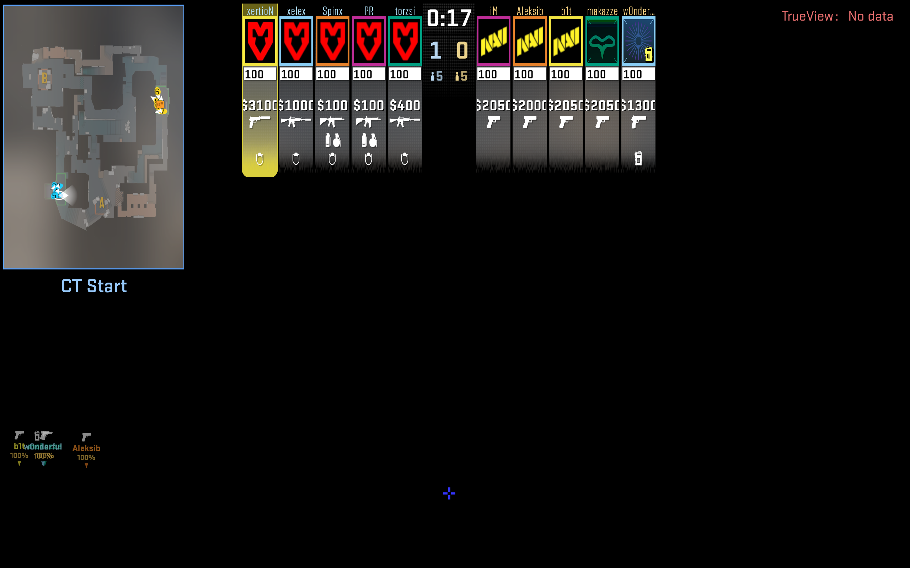
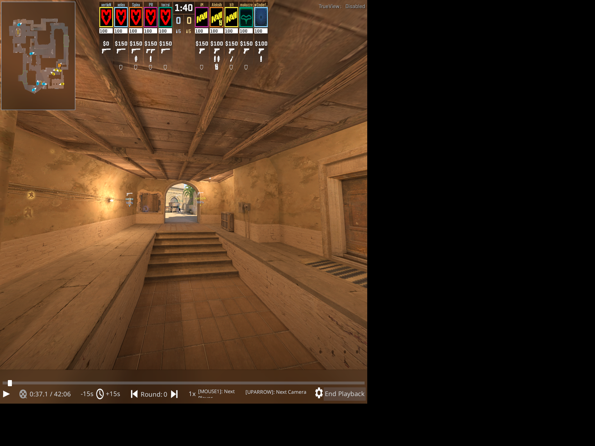

# 16 — Can the panel carry the HUD alone?

**Question.** The user's report was "the score is not visible, and the player names live a
life of their own". [Experiment 14](14-when-the-ui-is-drawn.md) had already built the quad
layer that [issue #2](https://github.com/vr-meta/cs2-vr-spectator/issues/2) asks for, and
it worked — but it carried the **whole main pass**: the finished world with the HUD
composited on top, opaque, 1.6 m wide at 1.8 m away. That is about 48 degrees of the view
blocked by a second copy of a world the eyes are already showing. Nobody would leave that
switched on, so nobody did, so `cl_drawhud 0` stayed in the config and there was no score.

The obvious fix is to wipe the world out of the back buffer between the world and the UI,
and composite the quad with source alpha. It rests on one thing nobody knew:

**What does Panorama write to the alpha channel?**

Blending source-over onto a zeroed target leaves colour already premultiplied by alpha,
whichever way the blend state is set up. Alpha is the question. Three outcomes:

| what the blend state does to alpha | result |
| --- | --- |
| separate alpha blend, `ONE`/`INV_SRC_ALPHA` | correct |
| `SRC_ALPHA` on alpha as well | a², glyph edges slightly too transparent |
| alpha write-masked | alpha stays 0, the runtime multiplies the panel by nothing, **invisible** |

The third outcome looks exactly like "the feature does not work", which is the worst kind
of failure to debug with a headset on. So it was measured first.

## Measuring it without a headset

`mirv_vr_panel alpha [n]` copies the finished main pass into a staging texture, maps it,
and counts. `MirvVrXr_WantsPanel()` no longer requires a session, so the main pass is
handed over with no runtime and no Quest in the building.

```powershell
scripts\launch-cs2-experiment.ps1 -SelfBuilt -Demo pro_mirage.dem -ExecCfg exp16_panel `
    -Width 2528 -Height 2780
scripts\send-key.ps1 -Key F11   # pause
scripts\send-key.ps1 -Key F3    # cl_drawhud 1
scripts\send-key.ps1 -Key F1    # force the two eye passes
scripts\send-key.ps1 -Key F5    # panel on
scripts\send-key.ps1 -Key F7    # read the alpha channel
```

```
mirv_vr_panel alpha: 2528x2780, alpha 0 59.68%, alpha 255 16.50%, in between 23.82%
  pixels with colour but no alpha: 0.015%
```

**The channel is not masked.** Three consecutive frames gave identical figures, which is
what a paused demo should give and is worth having as a check on the probe itself.

The 0.015% is the interesting number, not the 59.68%. It is the count of pixels the HUD
lit but left transparent — the write-masked signature — and at fifteen thousandths of a
percent it is antialiasing fringe, not a masked channel.

## What it carries



Score, round timer, both teams with names, health and money, radar, kill feed. On nothing.
This is the whole of the user's "the score is not visible": it was there all along, at
screen depth in both eyes, outside the lenses' frustum, under `cl_drawhud 0`.

The side effect is that the **monitor** shows this too whenever the main pass is the last
pass presented. The monitor is not the deliverable.

## Cutting it up, and a measurement that was wrong twice

One quad carrying the whole sheet is a portrait rectangle with an empty middle, parked at
eye height: the score floats at the horizon in the middle of the map, the timeline lies
across the floor, and the whole of it is too small to read. Roughly 2° per player on the
team strip against the Quest's ~25 px/deg — names truncated, money a few pixels tall.
Making the sheet twice as big to fix that walls off the view.

So each group gets its own quad, cut out of the same swapchain image with its own
`imageRect`, its own place and its own angular size. Everything not named is never shown,
which is also how the overhead name tags and the `TrueView` debug text stay off the panel
without hunting for a cvar.

That needs the rectangles as fractions of the sheet — and the sheet is what neither of the
two attempts at measuring it had actually seen. `grab-cs2-window.ps1` takes the window as
the *screen* shows it, and a 2528x2780 window on a 2560x1600 display is cut off at 58% of
its height. Every fraction below v = 0.58 in the first table was invented. The honest
capture is the same 0.909 aspect at a size that fits:



(Captured with a session running, so what the monitor presented was an eye pass rather than
the cleared main pass. Irrelevant here: Panorama lays the HUD out from the window's shape,
so the positions are the same whatever is underneath, and positions are all this is for.)

| group | u | v | placed |
| --- | --- | --- | --- |
| score | 0.26–0.74 | 0.00–0.18 | up at +16°, 46° wide, 2.0 m |
| radar | 0.00–0.21 | 0.00–0.28 | left at +30°, down 18°, 26° wide, 1.6 m |
| bar | 0.00–1.00 | 0.93–1.00 | down at −32°, 54° wide, 1.4 m — a dashboard, and what a controller ray will click |
| killfeed | 0.74–1.00 | 0.02–0.32 | **off, and a guess**: there were no kills on screen when the sheet was captured |

`mirv_vr_panel layout` prints them, `region` moves one, `rect` re-cuts one, and `sheet`
puts the single quad back. They are fractions, so the resolution does not matter — but
`hud_scaling` and the window's **aspect** both do.

## How it is done

- `MirvVrXr_RenderThread_ClearForPanel` is pushed onto the **main pass's `BeforeUi`**
  queue in patch 002, next to the existing `BeforePresent` push that hands the pass to the
  quad. Per-pass command queues, not `g_AfxVrPassIndex` — [experiment
  14](14-when-the-ui-is-drawn.md) measured that the engine thread and the render thread are
  a pass apart, so the pass index read on the render thread is not the pass being
  presented.
- The back buffer is `R8G8B8A8_TYPELESS`, which no view can name, so the render target
  view is created with an explicit `UNORM_SRGB` desc. It is cached, keyed on the texture
  pointer — a device object created and destroyed forty times a second is not free — and
  released when the panel is switched off, because holding a view on the back buffer would
  stop the swap chain resizing.
- `XR_COMPOSITION_LAYER_BLEND_TEXTURE_SOURCE_ALPHA_BIT` on the quad, and deliberately
  **not** `UNPREMULTIPLIED`: the colour is already premultiplied, and asking the runtime to
  divide by alpha a second time makes every glyph edge bloom.

## One bug found on the way

`mirv_vr_panel on` in a startup config ran before any session existed, found no head pose
to place the panel in front of, and left it switched on but never placed — so it was never
submitted. Indistinguishable from the feature not working. The panel now places itself the
first time a pose exists, from the midpoint of the two eyes.

## What this does not fix

Name tags. They are world-anchored and placed with the client's own projection; the panel
cannot carry them and they are wrong in an eye. [Issue
#3](https://github.com/vr-meta/cs2-vr-spectator/issues/3), and the larger half of it —
the tags being laid out for the demo camera's orientation while the eyes use the headset's —
is addressed separately by writing the head pose at the view-setup trampoline rather than
only between passes.

## Defaults this changes

`vr.cfg` now ships `mirv_vr_xr ui out`, `cl_drawhud 1`, `mirv_vr_panel on`. `cl_drawhud` is
one global switch for the eyes and the panel alike; the eyes stay clean because they are
captured before the UI is composited.
